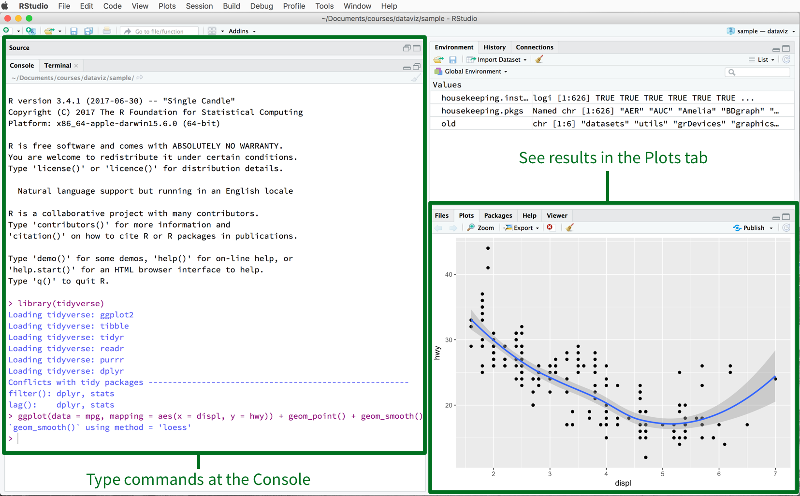

```{r setup, include=FALSE}
knitr::opts_chunk$set(echo = TRUE)
```

# 1. Introduction

This is a working document designed to give a basic introduction to R for those who have no coding experience. This should help you get prepared for applied projects in CPLN and MUSA 500-600 level coursework within a couple of weeks. It coalesces introductory materials I've developed over the past five years for MUSA 508, MUSA 795, CPLN 501, and CPLN 675 and should give you what you need to get started in any of those courses.

This isn't a "coding" tutorial, it's a starter kit that demonstrates how R can do some familiar Excel or ArcGIS-like tasks - loading spreadsheets and spatial data, creating new columns of data, summarizing and querying data, making charts and maps - and do them faster, better, and more reproducibly.

Use the table of contents at left to navigate through the document - the simplest topics are first (e.g. "What is R?", "How do I download R?"), the latter sections are more advanced (Geoprocessing, Census Data etc). There are references to books and reference materials at the end of the doc.

This document will be updated on an ongoing basis (it's a construction site). Right now, sections 1-8 are complete - which is what students in CPLN 675 will need to get up and running this spring!

**Michael Fichman**

*Lecturer, Department of City and Regional Planning*

*Interim Program Director, Masters of Urban Spatial Analytics*

*Researcher, PennPraxis*

*Data Scientist - Center for Safe Mobility*

*University of Pennsylvania Weitzman School of Design*

# 2. Getting Started with R

## What is R?

R is a programming language you can use to do stuff that you can do in Excel, or ArcGIS, or stats software like SAS... but (with some practice) faster, better, and more efficiently. 

You can load data in spreadsheet form, make new columns, create data summaries, make charts, make maps. You can load spatial data and use R as a GIS. You can make statistical models.  You can also do way more complicated stuff too. *Most importantly, you can set up routines or workflows to let you repeat processes that in other software would take lots of clicks and steps.*

It's "open source," which means it is written and maintained by a community of people like you and me. That also means that sometimes, things will go wrong and there isn't always a manual to consult.

If you've never programmed before, that's OK, you're in the right place.

## What is R Studio?

I run R code and do projects in R Studio, which is like a viewer for R. You can write code to load and manipulate data. You can see plots and data sets that you've loaded using R Studio. 

## Installing R and R Studio for Windows and Mac. 

1.	Install R: Go to [https://cran.r-project.org/bin/windows/base/](https://cran.r-project.org/bin/windows/base/)
2.	Click on your operating system (Windows, MAC, Linux) and follow directions to DL the most recent version of R – which is 4.1.1 as of this writing.
3.	DL and run the .exe file to install
4.	Install R Studio: Go to [http://www.rstudio.com](http://www.rstudio.com), click on “Download RStudio” and follow the directions for your operating system. 
5.	Open R studio by clicking on the icon, R will run inside the R Studio user interface.

## R Studio Orientation

Now open up R Studio and let's take a look at some of the components.


Your R Studio GUI (graphical user interface) should look something like this (Image by Kieran Healy)

### The Console

You can type and execute code in the console.

I could type something like `myName <- "Michael"` into the console, and it would create a variable called `myName` that is equal to the character string "Michael" in my "environment."

Go ahead, try it.

```{r michael}

myName <- "Michael"

```

### The Environment

This is where you can see the data sets and other things you've loaded into R to work on. If I load an excel spreadsheet into R using `read_excel`, I could say something like `myData <- read_excel("filepath_on_my_computer.xlsx")` it will show up in my environment as a thing called `myData`.

You can clear the environment by going to the `Session` dropdown and saying `Clear Workspace`.

You can also save your environment or load up an old one from a project you were working on.

### The Code window

If you load up a .R or .rmd file - two types of R files, they will show up as tabs in your code window.

If I give you some code, you can execute it a piece at a time by copying-and-pasting into the console, or highlighting code and hitting `ctrl+Enter` to run it.

If you are writing code, you can save your code as either a .R file (just plain code), or a .rmd file (a Markdown file, like what you are reading now, which is something you can write to present code or analysis.)

### The Plotting / Files / Packages etc Window

-If you make charts or plots - they show up in this window.

-The "Files" tab is a place to graphically look through file trees on your computer.

-You can consult the "Packages" or "Help" tabs to find documentation about different functions and packages in the R world. (More about packages later)

# 3. Data and Coding Basics

How do you "run code" in R?

Usually, I will give you a bunch of code in class, and you will have to adapt that code for a project you are doing. Eventually, you will write some of your own code - but *most people cut and paste stuff* and switch variable names and input data sets around. That's how I do much of my work - I grab things from my code base I've generated over the years. So don't worry about writing things from scratch.

- Code with a `#` in front of it is called "commented code." This stuff doesn't execute it's where you make notes.

- Code without the `#` will run - either as written in the console or by hitting ctrl+enter on code the code window

```{r commented}

# This code doesn't do anything, but the next line does
print('hello world')

```

R is case sensitive - many of your issues can be resolved by checking your syntax. You might get some kind of error because you created a data set called `derp` and you try to call it in the code with `DERP`. Happens *all the time*.

TUTORIAL:

**If this is your first time using R, you might want to try out a .R script called `running_code_in_R.R` which [you can find here](https://github.com/mafichman/R_FAQ_For_Planners/blob/main/R/running_code_in_R.R). It has some simple code and simple operations you can try - download the .R file, load it into your R Studio and follow the instructions to create some simple objects.**

## Naming Variables and Data Sets

Most pieces of data you load into R or create with R will have a name. If you load in a spreadsheet, you will want to give it a name so it shows up in my R environment.  You can assign information to a variable using this sign "<-"

You can have all kinds of data objects:

- A data frame: a matrix of data with column names, basically like an excel spreadsheet (much more on this later)

- A vector: a list of items, denoted with the letter c, like this:
```{r myVector}
myVector <- c("A", "B", "C")
```
- A character: some things treated as text, denoted with "" quotes around it.

```{r myVariable}
myVariable <- "derp"
```
- A number: can be in the form of an integer or a double (a floating point number).

```{r myNumber}
myNumber <- 10
```

## NA Data

There are numbers, characters, and other data types. There are also `NA` data - missing data - these are tricky. You can't do arithmetic on these.

Look at the example below. We create a vector of numeric data called `vector1` which is just numbers, and then we ask its median. That works.

Then we create one called `vector2` with some NA in there, it doesn't work to take the median there.

```{r vector1}
vector1 <- c(1, 4, 6, 7, 10)

median(vector1)
```

```{r vector2}
vector2 <- c(1, 4, 6, NA, 10)

median(vector2)
```

# 4. Installing and Loading Packages

A lot of the things you will want to do with R will require loading packages. "Base R" is basic R - there are a bunch of functions it does. Since R is open source, lots of people have developed their own cool packages that do additional stuff.

A package is a set of functions - some of them make graphics, some handle spatial data. You will almost always start your session by loading some packages.

The first time you use a package on your computer, you can load it with the command `install.packages`, like this:

```{r install_pkg, eval=FALSE, include=TRUE}
install.packages('tidyverse')
```

If you have already installed a package on your computer, you can load it into your environment using the `library` command.

```{r load_pkg ,message = FALSE, warning = FALSE}
library(tidyverse)
```

Packages all come with documentation - lists of functions in these packages have little vignettes that tell you how to use them.  Check that out in the "Packages" tab in your R Studio environment to see these, or just google package names or function names to find the documentation.

You can also type things like `??select` in your console and documentation about the function `select` will pop up in your "Help" window in R Studio.

## The Tidyverse

The `tidyverse`, which we loaded in the previous code chunk, is a group of important packages which are used to wrangle data, make graphics, load data, handle dates, handle text. Better yet, these projects are coordinated by their developers, so they all work nicely together.

For work in our class, you should load up the tidyverse on every project. Most of my code doesn't work without it.

# 5. Loading and Viewing Data 

Most projects will start with you loading some spreadsheet-like data - from a survey you conducted, from an excel sheet, from the Census' website, from a shapefile that I gave you for class. For non-spatial data, these spreadsheet-like data will be in a format called a "data frame" (or as a variant called a "tibble).

There are a lot of file types you can load, and some of them have their own functions, like you can read in Excel data with the `read_excel` function in the `readxl` package. Later on I will show you how to read in a .shp. (You can read more about these data import functionalities [here.](https://raw.githubusercontent.com/rstudio/cheatsheets/main/data-import.pdf))

There are several ways to load data into your R environment.

## Loading Data From Your Computer

You can load data from your computer in one of two ways, either by going to `File / Import Data Set` in a dropdown menu R Studio, and clicking on the relevant options (note that "From txt" will let you load a csv, txt, tsv or other similar file types), or by doing it with code, like this:

```{r myData_cpu, eval = FALSE}
myData <- read.csv("filepath/onMyComputer/fileName.csv")
```

## Loading Data from the Web

You can load data from the web, like from Google Drive or Github, using the same kind of syntax. Here we load a csv from the web:

```{r myData_url}
myData <- read.csv("https://raw.githubusercontent.com/mafichman/R_FAQ_For_Planners/main/data/someCensusData.csv")
```

## Viewing Data

Now that you've loaded in some data, you can examine them in several ways. You can `View(myData)` and see a visual representation of the data in an excel-like way, or you can `glimpse` your data frame.

`glimpse` will tell you what data types the columns are (character, numeric, etc), let you see some samples of the data, and let you see how many rows and columns the data contain.

```{r glimpse_myData}
glimpse(myData)
```
## Writing Data to File

After you manipulate data, you might want to write it out to file. Everything we are doing in the R-Studio environment does not affect the underlying data - so any project you do might need a step where you out put data.

You can do this with commands like `write.csv` - so you could data your data frame `myData` and write it out as a file with a name and location of your choosing like so:

`write.csv(myData, "your_file_path/your_file_name.csv")`

We talk a bit later about reading/writing spatial data as well.

# 6. Manipulating Data with dplyr

`dplyr` is the core data wrangling package in "tidy" R. You can use functions from `dplyr` to manipulate data frames. 

You can make new columns, and remove or rename columns from your data frame. You can summarize data (e.g. what is the sum of all the rows in a given column). You can filter data to keep only rows that meet some criteria.

It does lots of other stuff too.

There is a handy guide for all the dplyr data tools at [R Studio's dplyr cheat sheet](https://raw.githubusercontent.com/rstudio/cheatsheets/main/data-transformation.pdf).

## Using the "Pipe"

*Very important*, to what I'm about to show you from here on out is a thingy called a "pipe" - `%>%` - which is an object you put in your code to chain functions together and make kind of data-wrangling recipes.

To understand what the pipe does, think about the following "recipe" like this: I make an `omlette` by taking a data frame called `eggs` and applying the functions `scramble` and `fry`

`omlette <- eggs %>% scramble() %>% fry()`

OK, keep that in mind while we look at `dplyr` commands.

## Dplyr commands

Let's use a few basic `dplyr` commands to wrangle our dataframe `myData`.

### Mutate

`mutate` makes a new column. I am going to *overwrite* `myData` - making a new version that has a new column in it. Each row of the data frame represents a census tract, and I'd like to see what the difference is in tract population between 2010 and 2016. I'll call this new column `pop_change` and set its value equal to `total_pop.2016` minus `total_pop.2010`. Note the pipe used to "chain" the mutate statement in there.

```{r mutate_first}

myData <- myData %>%
  mutate(pop_change = total_pop.2016 - total_pop.2010)

```

Did it work? Try typing `View(myData)` or `glimpse(myData)` into your console.

I'm now going to create a second variable called `pop_change_positive` using `mutate`. If the population change was positive, I'm going to call set this variable equal to `TRUE` - I'll do an `ifelse` statement to make it's value contingent on the value of `pop_change`.

```{r mutate_second}

myData <- myData %>%
  mutate(pop_change_positive = ifelse(pop_change > 0, TRUE, FALSE))

```

### Filter

`filter` lets you reduce your data frame based on some criteria. I'd like to create a new data frame called `population_loss` that consists only of census tracts in `myData` that lost population (e.g. pop_change_positive == FALSE).


```{r filter}
population_loss <- myData %>%
  filter(pop_change_positive == FALSE)
```

I can do this kind of filtering based on lots of criteria.

### Select

`select` keeps only certain columns that you want to keep.

I'm going to make a new data frame, called `twoVariables` that consists of only the columns `NAME.y` and `GEOID` from the data frame `myData`

```{r select}
twoVariables <- myData %>%
  select(NAME.y, GEOID)
```

### Rename

`rename` changes the names of your columns. I'd like to rename the column from the data frame `twoVariables` called `NAME.y` to be called just `NAME`

```{r rename}
twoVariables <- twoVariables %>%
  rename(NAME = NAME.y)
```

## Summarizing Data

You'll often want to know about the characteristics or central tendencies of your data. Using the `group_by` and `summarize` commands you can do lots of this.

Here are some examples - notice I'm not creating new data frames here.

First, let's just find out what the median `pop_change` was between 2010 and 2016 for Philadelphia census tracts.

```{r summarize_1}
myData %>%
  summarize(median_pop_change = median(pop_change))
```

What if we want to know how one type of tract versus another varied in terms of `pop_change`? We can group our data into categories using `group_by` and then summarize.

For tracts for which `pop_change_positive` (remember we created this column as a TRUE/FALSE - was there population change between 2010 and 2016?) what is the median `pop_change`?

```{r summarize_2}
myData %>%
  group_by(pop_change_positive) %>%
  summarize(median_pop_change = median(pop_change))
```

## Joining Data

Under construction

# 7. Making Plots with ggplot2

`ggplot2` is the main graphics library in the `tidyverse` - it's fantastic. You can make bar plots, line plots, and much more with it.

You make ggplots by writing "recipes" for charts. The `+` operator is a bit like what the `%>%` is in dplyr/tidyverse - you use it to add elements together.

The core elements of ggplot recipes are called geometries (a `geom`), and the way you style the data is with aesthetics (`aes`). You can add some other styles to your ggplots, but if it involves changing something about the appearance of the plot based on data, you use an `aes` call.

There are lots of resources for ggplot - the simplest and easiest one to check out is [R Studio's ggplot cheat sheet](https://raw.githubusercontent.com/rstudio/cheatsheets/main/data-visualization.pdf). There is also a whole (free) book on data viz in ggplot - [Data Visualization by Kieran Healy](https://socviz.co/). It's fantastic.

## Making a basic plot

Let's make a simple scatterplot.

Think about the "recipe" for the following chart where we see plot Philadelphia census tract median household income as a function of the tract's pencentage of vacant housing units using this narrative (remember each row in myData is a Philadelphia census tract):

- Make me a ggplot
- Add a point geometry from the data set `myData` where the x aesthetic is `vacancyPct.2016` and the y aesthetic is `med_HH_Income.2016`

```{r ggplot1, warning = FALSE}
ggplot()+
  geom_point(data = myData, 
             aes(x = vacancyPct.2016, y = med_HH_Income.2016))
```

## Adding more aesthetics

We can add more aesthetics to this plot. Let's do this first by just tinkering with the colors to make it look cool - we will do this with some commands *outside* the aesthetics to make the points blue.

```{r ggplot2, warning = FALSE}
ggplot()+
  geom_point(data = myData, 
             aes(x = vacancyPct.2016, y = med_HH_Income.2016),
             color = "blue")
```

OK, now let's make the point coloration change according to a data-related element, something we have to specify in the aesthetics. We specify the color as being equal to `pop_change_positive`:

```{r ggplot3, warning = FALSE}
ggplot()+
  geom_point(data = myData, 
             aes(x = vacancyPct.2016, y = med_HH_Income.2016, color = pop_change_positive))
```

## Facets

You can very simply make "small multiple" plots where you subdivide your data into categories for graphic comparison. This is done with the `facet_wrap` command. 

Here's an alternate take on our previous plot, cut into two plots. Notice in the code I pulled `pop_change_positive` out of the aesthetics from the previous plot and put it in the `facet_wrap` command.

```{r ggplot4, warning = FALSE}
ggplot()+
  geom_point(data = myData, 
             aes(x = vacancyPct.2016, y = med_HH_Income.2016))+
  facet_wrap(~pop_change_positive)
```

## Advanced graphics

You can alter most elements of the ggplot. We could take our initial scatterplot and do some things to spruce it up, like add a title, change the axis labels etc.,

```{r ggplot5, warning = FALSE}
ggplot()+
  geom_point(data = myData, 
             aes(x = vacancyPct.2016, y = med_HH_Income.2016))+
  labs(title="Philadelphia Tract Med. HH Income as a Function of Pct. Vacancy",
       subtitle = "Data: US Census Bureau, 2016 ACS 5-Year Estimates",
        x ="Pct Vacant Housing Units (0-1)", y = "Median Household Income (2016 $)")
```

I like to make some pre-made recipes where I style the lines, fonts and other elements, and then I can just add it to my plots. Here's a recipe I call `plotTheme`. Load it up into your environment and then you can add it to your plots to make them nicer. The sky is the limit.

```{r plotTheme}

plotTheme <- theme(
  plot.title =element_text(size=12),
  plot.subtitle = element_text(size=8),
  plot.caption = element_text(size = 6),
  axis.text.x = element_text(size = 10, angle = 45, hjust = 1),
  axis.text.y = element_text(size = 10),
  axis.title.y = element_text(size = 10),
  # Set the entire chart region to blank
  panel.background=element_blank(),
  plot.background=element_blank(),
  #panel.border=element_rect(colour="#F0F0F0"),
  # Format the grid
  panel.grid.major=element_line(colour="#D0D0D0",size=.75),
  axis.ticks=element_blank())
```

Now I can add `plotTheme` to my recipe from the last plot for some extra styling. Notice I just tack it onto the recipe below with a `+`:

```{r ggplot6, warning = FALSE}
ggplot()+
  geom_point(data = myData, 
             aes(x = vacancyPct.2016, y = med_HH_Income.2016))+
  labs(title="Philadelphia Tract Med. HH Income as a Function of Pct. Vacancy",
       subtitle = "Data: US Census Bureau, 2016 ACS 5-Year Estimates",
        x ="Pct Vacant Housing Units (0-1)", y = "Median Household Income (2016 $)")+
  plotTheme
```

# 8. Tidycensus

You can access the US Census using the `tidycensus` package - this is much faster than grabbing Census data on the web. You can grab the variables you want with or without spatial data attached. 

Even if you *only* use R for this - you're making your life a bit easier. You can grab data with `tidycensus`, write it to file (more on this in the next section) and then use it in Excel or ArcGIS.

Here's how it works - you "tell" the census, through some R Code, that you want certain variables, for certain years, and certain geographies, and it returns it to you in your R Environment.

There is a whole book on tidycensus from it's creator/maintainer (*cough cough MUSA Masterclass guest speaker 2021*) [Kyle Walker](https://walker-data.com/census-r/).

## Load the tidycensus and sf packages

To use `tidycensus` you should install and load the `tidycensus` package. We are going to grab some spatial data as well, so load the `sf` package.

If you don't have these packages installed, you should install them as follows (if you do, skip this step):

```{r install_packages, warning = FALSE, eval = FALSE}
install.packages('tidycensus')
install.packages('sf')
```

OK, if you have the packages installed on your computer, now load them into your R environment with a `library` call:

```{r setup_packages2, warning = FALSE, message = FALSE}
library(tidycensus)
library(sf)
```

You will need a "key" to access the Census API. You can find one at [their website](https://api.census.gov/data/key_signup.html).

Paste it into the code block below and run it to load your key in to your R environment:

```{r load_key_hide, warning= FALSE, include=FALSE}
census_api_key("e79f3706b6d61249968c6ce88794f6f556e5bf3d", overwrite = TRUE)
```

```{r load_key, warning = FALSE, eval = FALSE}
census_api_key("YOUR KEY GOES HERE", overwrite = TRUE)
```

## Load census data dictionaries

Now that we have our census credentials loaded, we can start downloading information from the API using some functions from tidycensus. We are going to grab some 2016 ACS estimates for Philadelphia census tracts. In order to choose variables of interest, we are going to load the 2016 ACS data dictionary using the tidycensus function `load_variables`. We turn it into a dataframe called `acs_variable_list.2016`.

```{r load_variables, cache = TRUE}
acs_variable_list.2016 <- load_variables(2016, #year
                                         "acs5", #five year ACS estimates
                                         cache = TRUE)
```

Once we have loaded these data, we can observe and search through the data frames of variable information which should appear in our global environment either by clicking on them or using the `View(acs_variable_list.2016)` command.

Look around in th data frame for a few minutes and see what's in there.

# Downloading Data from Tidycensus

## Create a vector of census variables

We can populate a vector of variable names we will send to the Census API. We call this list `acs_vars`. This is the beauty of a code-based workflow - you can take this vector and put anything you want in it when you have a new analysis to do and re-run it for different variables. These need to be character strings, and hence, in quotes as you see below.

Keep in mind the categories and code numbers change a bit over time - you may need separate vectors for different census years.

```{r acs_vars}
acs_vars <- c("B01001_001E", # ACS total Pop estimate
              "B25002_001E", # Estimate of total housing units
              "B25002_003E", # Number of vacant housing units
              "B19013_001E", # Median HH Income ($)
              "B02001_002E", # People describing themselves as "white alone"
              "B06009_006E") # Total graduate or professional degree
```

## Call the Census API to get tract level data for 2016 for all of Philadelphia

We use the `get_acs` function in `tidycensus` to query the API. Notice the different arguments for the function, and that they require certain types of info. For example, `geography` requires one of a finite list of answers, and they have to be formatted as character string.

Remember the `??` function - you can learn about the parameters for `get_acs` this way. There is also a function called `get_decennial` which you can use for decennial census counts.

We ask for data on our `acs_vars` for all tracts in Philadelphia County, PA in 2016. We ask for "wide" data (e.g. one variable per column, one row per tract) and we set `geometry` to `FALSE`. (Later, we will set `geometry` to `true` and get some spatial data.)

```{r get_acs_2016, cache = TRUE, message = FALSE, warning = FALSE}
acsTractsPHL.2016 <- get_acs(geography = "tract",
                             year = 2016, 
                             variables = acs_vars, 
                             geometry = FALSE, 
                             state = "PA", 
                             county = "Philadelphia", 
                             output = "wide") 
```

Voila - now you have census data. Take a look and see what you have there - since it's the ACS, they are estimates - so you'll have data marked "E" for estimate, or "M" for margin of error.

Let's use a `glimpse` command to check it out

```{r glimpse_census}
glimpse(acsTractsPHL.2016)
```

## Clean Census Data

The variable names that come with the stock Census data aren't that helpful.

You can use the `rename` function from `dplyr` to make the columns in your data intelligible.

```{r do_some_dplyr, cache = TRUE}
acsTractsPHL.2016 <- acsTractsPHL.2016 %>%
  rename (total_pop.2016 = B01001_001E,
          total_HU.2016 = B25002_001E,
          total_vacant.2016 = B25002_003E,
          med_HH_Income.2016 = B19013_001E,
          total_White.2016 = B02001_002E,
          total_GradDeg.2016 = B06009_006E)
```

# 9. Vector GIS With sf

Coming Soon!

## Load in some spatial data

## Understanding sf objects

## Making Maps With ggplot

## Vector Geoprocessing

## Reading and writing spatial data

You can write out any sf objects as .shp files which are readable in ArcGIS. This is especially useful if you want to just use R to grab data efficiently and want to map it elsewhere. I prefer to write geojsons - they are more widely usable and the column names are more stable.

Use the fuction "st_write"

`??st_write`

You can also read in shapefiles with an `shp` file extension using `st_read`.

# 10. Publishing Analyses with R Markdown

TBD

I will probably be asking you to turn in assignments using R Markdown. Markdown is a way to present your code-based projects as a more polished document (you're reading a markdown right now!). For more details on using R Markdown see <http://rmarkdown.rstudio.com>.

If you want to see how markdown works - you can find a download button at the top right of this document and download the code that was used to make this.

TBD incl - Global Options, Chunk Options, kable tables

# 11. Querying APIs

TBD incl - Socrata and REST API query functionalities for R.

# 12. Other Spatial Packages

Mapview, Leaflet, osmdata, raster

# 13. Project Workflows - Github and R Projects

Github, R Projects, Writing Readable Code

# 14. Resources and texts

This section contains online resources for learning R and troubleshooting code-based problems.

## Troubleshooting - How to ask a question

It's super important to know how to ask a good question on the internet or on the class forum about some issue you are having. Googling around is a really good way to find help - so you can google something about the error you are having, or look on [https://stackoverflow.com](https://stackoverflow.com), which is a community of people doing Q&A and troubleshooting.

You can look up details about the functions you are using in R using the `??` command in your console like this:

`??read.csv`

You can also check out the documentation about the packages, functions and the arguments they take in the Packages tab in the Viewer window in R Studio.

If you are going to ask a question on the class forum, include some code, and details about your problem - like the data sources that you tried to use and how they look. This allows somebody to reproduce the issue on their own, or at least understand it.

*A good question gives your respondent lots of background info:*

- What is the nature of the data in your question? Can you post a `glimpse` command so we can see what the column names and data types are?

- What is the code snippet that didn't run correctly?

- What kind of error message did you get?

- What packages do you have loaded?

- Did you google the question before you came and asked for help? (The answer should be yes).

## R Cheat Sheets

R Studio's website has some really good [cheat sheets](https://www.rstudio.com/resources/cheatsheets/) with simple walkthroughs of basic functions in some core packages

- [ggplot2 - graphics and plots](https://raw.githubusercontent.com/rstudio/cheatsheets/main/data-visualization.pdf)

- [dplyr - manipulating data frames](https://raw.githubusercontent.com/rstudio/cheatsheets/main/data-transformation.pdf)

- [sf - vector GIS](https://raw.githubusercontent.com/rstudio/cheatsheets/main/sf.pdf)

- [R markdown - document publishing, includes knitr](https://raw.githubusercontent.com/rstudio/cheatsheets/main/rmarkdown.pdf)

- [lubridate - dates and times](https://raw.githubusercontent.com/rstudio/cheatsheets/main/lubridate.pdf)

- [(readr - loading data)](https://raw.githubusercontent.com/rstudio/cheatsheets/main/data-import.pdf)

## Style Guides

Handy tips for making your code readable

- [R Style Guide](https://google.github.io/styleguide/Rguide.html)

- [Tidyverse Style Guide](https://style.tidyverse.org/)

## Books

If you're in a class with me - these books are likely to be among the required or supplemental readings. They are all fantastic, open source, and extremely, extremely useful. Here they are in "bookdown" form for free.

- [R for Data Science - Hadley Wickham](https://r4ds.had.co.nz/) - Text for CPLN 675

- [Public Policy Analytics - Ken Steif](https://urbanspatial.github.io/PublicPolicyAnalytics/) - Text for MUSA 508

- [Data Visualization - Kieran Healy](https://socviz.co/)

- [Geocomputation with R - Robin Lovelace](https://geocompr.robinlovelace.net/)

- [Analyzing US Census Data - Kyle Walker](https://walker-data.com/census-r/)

- [Geospatial Health Data - Paula Moraga](https://www.paulamoraga.com/book-geospatial/)

# FAQ

Common Q&A will go here